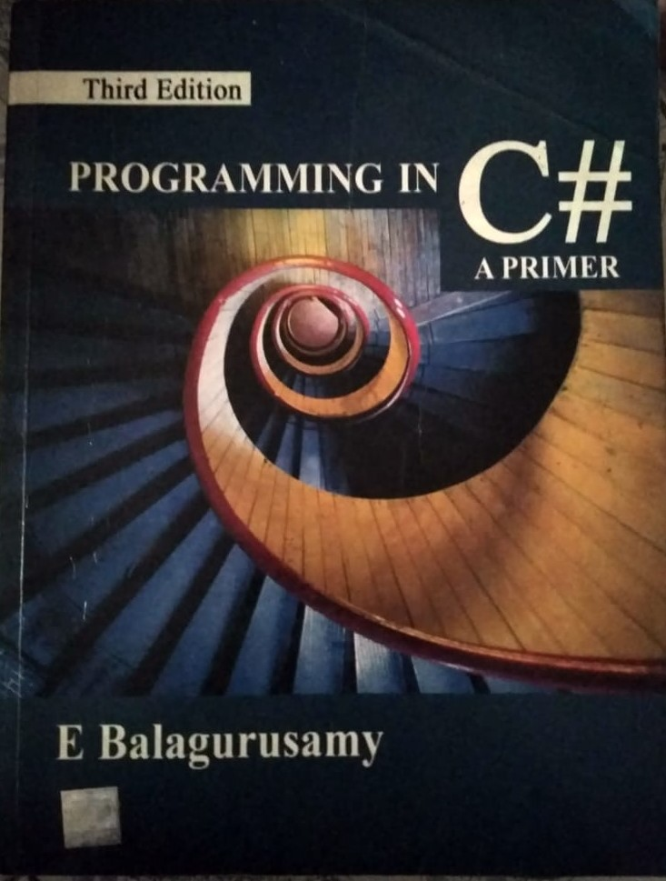

# E Balagurusamy C# solved exercise
I tried to solve each & every questions of all the exercise of **Programming in C# by E Balagurusamy**.  Chapter wise solutions are uploaded here. 

If your code is more efficient then your contribution is always welcome.

